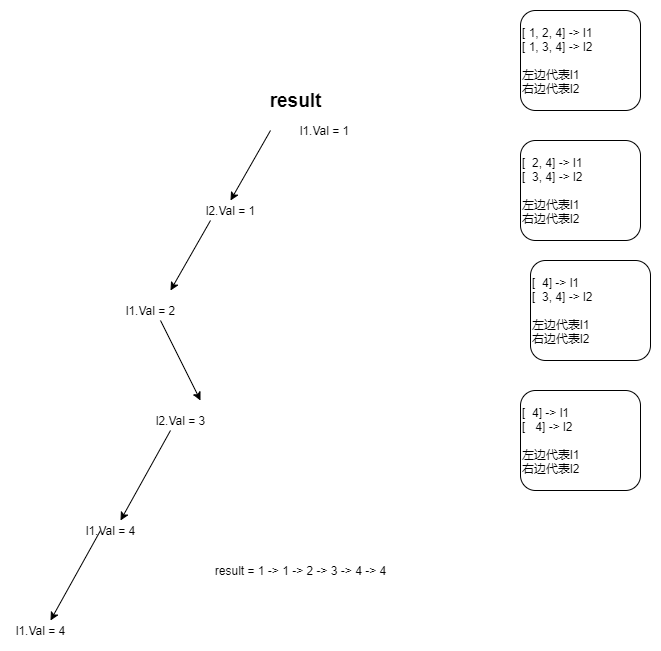

### 合并两个有序链表

循环，一个变量，指向头节点。curr为游走指针，谁小先指谁

```go
func mergeTwoLists(l1 *ListNode, l2 *ListNode) *ListNode {
    
    var res *ListNode = &ListNode{Next:nil}
    curr := res
    
    for l1 != nil && l2 != nil {
        if l1.Val < l2.Val {
            curr.Next = l1
            l1 = l1.Next
        }else {
            curr.Next = l2
            l2 = l2.Next
        }
        curr = curr.Next
    }
    if l1 != nil {
        curr.Next = l1
    }
    if l2 != nil {
        curr.Next = l2
    }
    return res.Next
}
```


### 递归



```go
func mergeTwoLists(l1 *ListNode, l2 *ListNode) *ListNode {
    if l1 == nil && l2 == nil {
        return l1
    }
    if l1 == nil {
        return l2
    }
    if l2 == nil {
        return l1
    }

    var result *ListNode
    if l1.Val <= l2.Val {
        result = l1
        result.Next = mergeTwoLists(l1.Next,l2)
    }else {
        result = l2
        result.Next = mergeTwoLists(l1,l2.Next)
    }
    return result
}
```